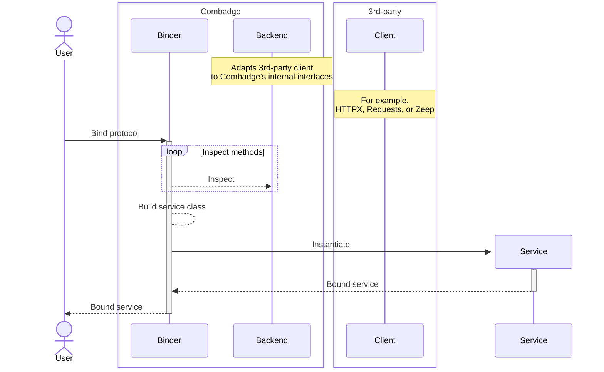
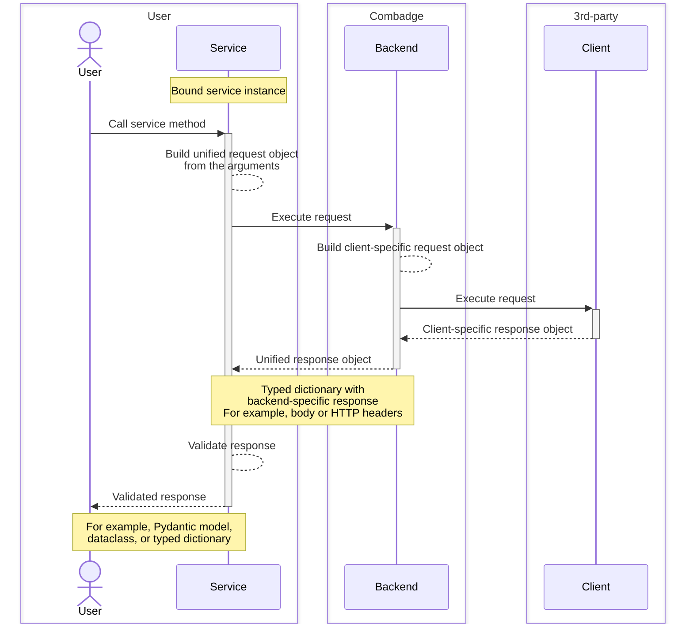

# How it works

## Service protocol

In Combadge, a definition of a service _protocol_ (also known as _interface_) is de-coupled from a service _implementation_. That allows a developer to define a service's interface and later bind it to a [_backend_][backends] which in turn is directly responsible for handling requests and responses. It is possible to reuse the same protocol with multiple different backends.

To define a service protocol, one makes use of the [PEP 544](https://peps.python.org/pep-0544/) aka «structural subtyping». Combadge inspects the protocol during «binding».

## Binding

In order to derive a service implementation, Combadge inspects the provided protocol and extract its methods and the method's signatures – this is where all the magic happens. The latter are used to derive request and response models.

Result of the binding is a _service class_ which encapsulates request and response handling.

### Which methods are inspected?

- Non-private instance methods – methods which names do not start with `_` and accept `self` as a parameter.
- [`__call__`](https://docs.python.org/3/reference/datamodel.html#object.__call__) which allows calling a bound client directly. This may be useful when the protocol is meant to represent a single method and would otherwise just result in the name duplication.

## Calling a service method

